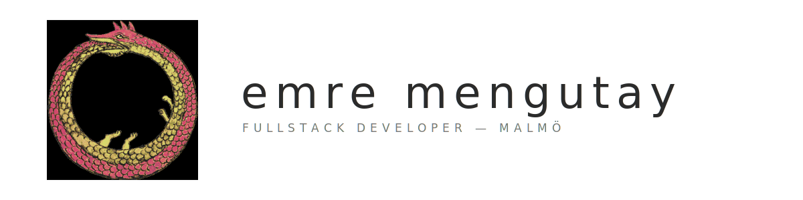

  

Bachelors in Computer Science with specilization in Software Engineering — malmö university.

backend in java, c# and go, frontend in react/vue/typescript. i build to understand how things work, and sometimes just to see if they can be built.

---

### selected work

| | | |
|---|---|---|
| [happycat](https://github.com/m8uwantcocoa/happycat) | a pet-care app for logging feeds, water, play and vet care. tamagotchi-adjacent | next.js · ts · prisma · supabase |
| [git-social](https://github.com/m8uwantcocoa/git-social) | a social feed built from real github activity — commits, prs, stars. follow coders, not recruiters | nuxt · vue · supabase |
| [primus-go](https://github.com/m8uwantcocoa/primus-go) | fire multiple endpoints at once, keep the first that answers. chains llm providers as fallbacks. no config, no deps | go |
| [soc-ai-l](https://github.com/m8uwantcocoa/soc-ai-l) | an autonomous social feed where every post is ai reacting to real news. you are the only human | ts · next.js · react |
| [interactive-weather-component](https://github.com/m8uwantcocoa/interactive-weather-component) | click anywhere on a map for a 24h forecast. headless react component, installs via npx | react · leaflet · chart.js |
| [movietrack](https://github.com/m8uwantcocoa/movietrack) | find a film's metadata and its soundtrack, with spotify integration | java · spring boot |

*[gulp archive](https://gulparchive.site) — a community energy-drink rating platform. live, source kept private.*

*keeb — a keystroke-rhythm monitor that locks the machine when the typing stops looking like yours. in progress.* | go · python · typescript · isolation forest |

---

### elsewhere

[emremengutay.se](https://www.emremengutay.se) · [linkedin](https://www.linkedin.com/in/emre-meng%C3%BCtay-a3a85a24b/)
