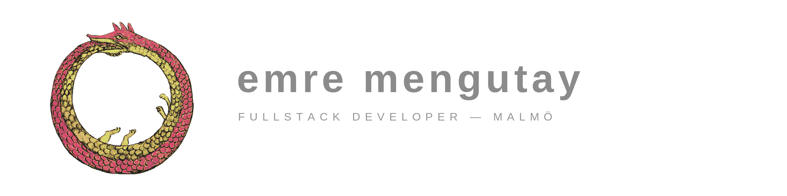

  

  bsc computer science, malmö university &nbsp;·&nbsp; backend in java, c# and go &nbsp;·&nbsp; frontend in typescript, react and vue
   
  malmö, sweden · open to roles in se / dk / no

  

 

### selected work

<table>
<tr>
<td colspan="2" valign="top">
01 · published 
<a href="https://mau.diva-portal.org/smash/record.jsf?pid=diva2%3A2077078"><b>ssh honeypot research</b></a> 
bachelor thesis. honeypots deployed across two clouds, attacker data pseudonymized with salted hashes, a gdpr analysis of the whole pipeline.  
 python &nbsp;  gcp &nbsp; oci
</td>
</tr>
<tr>
<td width="50%" valign="top">
02 
<a href="https://github.com/m8uwantcocoa/primus-go"><b>primus-go</b></a> 
fire multiple endpoints at once, keep the first that answers. chains llm providers as fallbacks. no config, no deps.  
 go
</td>
<td width="50%" valign="top">
03 · in progress 
<b>keeb-logger</b> 
a keystroke-rhythm monitor that locks the machine when the typing stops looking like yours.  
 go &nbsp;  python &nbsp;  typescript &nbsp; isolation forest
</td>
</tr>
<tr>
<td width="50%" valign="top">
04 · live 
<a href="https://gulparchive.site"><b>gulp archive</b></a> 
a community energy-drink rating platform, with real users.
</td>
<td width="50%" valign="top">
05 
<a href="https://github.com/m8uwantcocoa/git-social"><b>git-social</b></a> 
a social feed built from real github activity. social for coders, linkedin could never.  
 nuxt &nbsp;  vue &nbsp;  typescript &nbsp;  supabase
</td>
</tr>
<tr>
<td width="50%" valign="top">
06 
<a href="https://github.com/m8uwantcocoa/soc-ai-l"><b>soc-ai-l</b></a> 
an autonomous social feed where every post is ai reacting to real news. you are the only human.  
 next.js &nbsp;  react &nbsp;  typescript
</td>
<td width="50%" valign="top">
07 
<a href="https://github.com/m8uwantcocoa/happycat"><b>happycat</b></a> 
pet care logging: feeds, water, play, vet visits. tamagotchi-adjacent.  
 next.js &nbsp;  typescript &nbsp;  prisma &nbsp;  supabase
</td>
</tr>
<tr>
<td width="50%" valign="top">
08 
<a href="https://github.com/m8uwantcocoa/movietrack"><b>movietrack</b></a> 
search for a film, get its metadata and its soundtrack, with spotify integration.  
 java &nbsp;  spring boot
</td>
<td width="50%" valign="top">
09 
<a href="https://github.com/m8uwantcocoa/pepe-chat"><b>pepe-chat</b></a> 
real-time chat: dms, presence, offline delivery. the first-year java thread-per-client app, re-expressed as one hub goroutine. one binary.  
 go &nbsp;  vue &nbsp; websockets
</td>
</tr>
</table>

 

### elsewhere

  <a href="https://www.emremengutay.se">emremengutay.se</a> &nbsp;·&nbsp; <a href="https://www.linkedin.com/in/emre-meng%C3%BCtay-a3a85a24b/">linkedin</a>

